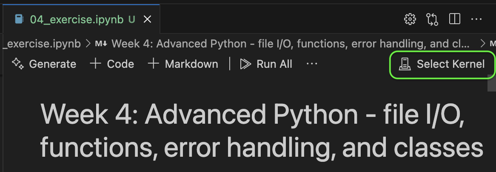
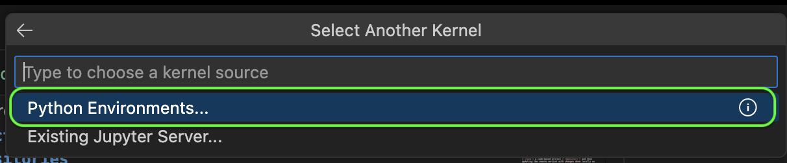
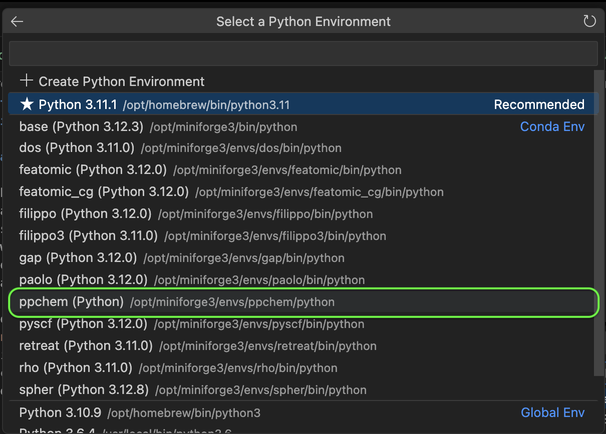
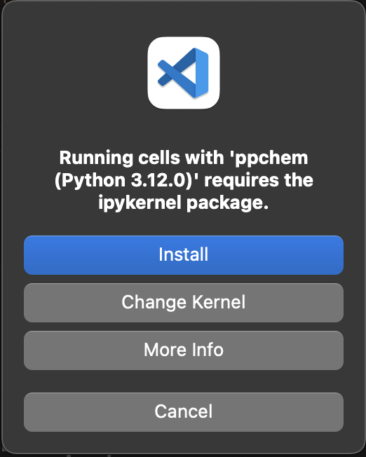

# Lecture 04: Advanced Python - file I/O, functions, error handling, and classes

This lecture focuses on developing some more advanced skills in Python. In this exercise, you will learn how to:

1. **write and read files** using what we learn previously about paths and file objects,
1. **use functions** as a re-usable way to perform specific tasks,
1. perform **error handling** to build more robust code and deal with errors more descriptively,
1. and finally **build classes** as a way to demonstrate object-oriented programming,

of course all with some chemical themes!

## Setup

There are no particular package dependencies required for this weeks exercises. However you still need to pull the repo updates from GitHub as you have done before. Open the exercise in a VSCode window, and open the jupyter notebooks directly in VSCode. 

You may have to install the IPython kernel when prompted, making sure you have selected the kernel in VSCode as follows.

First, open the exercises (or warm-up) notebook and click "Select Kernel" in the top right of the window:

Choose "Python Environments", and then select the appropriate environment. For me (your TA Joe) and for this given project (notice how I have many environments for different projects!), I want to select the "ppchem" conda environment:

Then when prompted install `ipython` (meaning interactive python) in this environment to allow you to run jupyter notebooks from VSCode:

## Warm-up

Make sure you have completed Exercise 3, and check out the [warm-up exercise](04_warm_up.ipynb) for a short recap on some python basics.

## Exercise

Now you're ready to give the [exercises](04_exercise.ipynb) a go!

## Extra reading

Being an effective computational scientist means writing code that (as a minimum) works, but very importantly is understandable and maintainable by human developers, ideally efficient, and useful. 

It is more and more common that computational science publications are published with well-documented and open-source code, both for the peer-review process and for community access post-publication. 

Even before this, following good coding practices can help you work and colllaborate more effectively. If you're interested in learning more, have a read of this paper ([arxiv.org/pdf/1210.0530](https://arxiv.org/pdf/1210.0530)) that outlines some general best practices for computational scientists.

As a bonus, you can check out the F.A.I.R. principles for data management (at [this link](https://www.go-fair.org/fair-principles/), but also explained in [this video](https://www.youtube.com/watch?v=5OeCrQE3HhE)) that serve as good guidelines when compiling data for collaborators or publications. Knowing all the fine details is not necessary at this point, but it's good to be aware that they exist and keep them in mind when working on projects.
